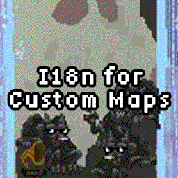

# JumpKing CustomMap I18n

https://steamcommunity.com/sharedfiles/filedetails/?id=3350517685

This is a mod to set up the localization of custom maps for JumpKing.

### TODO

- [ ] Level name
  - [ ] Title
  - [x] Menu
  - [ ] Results
- [ ] Credits
- [x] Location settings
- [ ] OldManSettings > looping_lines > OldManQuote
- [ ] RattmanSettings > text > lines
